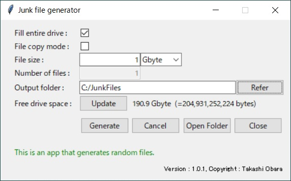
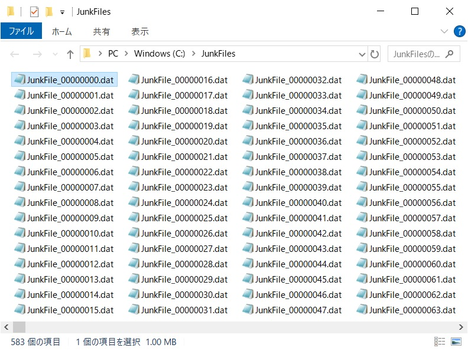

# Junk File Generator

**Junk File Generator** is a cross-platform Python application that creates junk files filled with random data.  
It's designed to help you safely dispose of or hand over storage devices by overwriting free space and making data recovery virtually impossible.





---

## Features

- Overwrite available space with random junk files
- Option to copy a single file repeatedly for faster operation
- Supports filling entire drives or generating a specific number of files
- Real-time display of:
  - Available free space
  - Estimated time remaining
  - Cancel operation anytime
- Multi-platform compatibility: **Windows / Linux / macOS**
- Minimal, GUI-based interface (requires Python)

---

## File Contents

```
\ (repository root)
|
+--- JunkFileGenerator.py                                  # Main application script
|
+--- JunkFileGenerator.txt                                 # English user manual
|
+--- JunkFileGenerator_Japanese.txt                        # Japanese user manual
|
+--- JunkFileGenerator.code-workspace                      # VS Code workspace file
|
+--- README.md                                             # This file
|
+-- \dist
        |
        +-- JunkFileGenerator_ExecutableForLinux.zip
        |       |
        |       +-- JunkFileGenerator                      # Executable file for Linux
        |
        +-- JunkFileGenerator_ExecutableForWindows.zip
        |       |
        |       +-- JunkFileGenerator.exe                  # Executable file for Windows
        |
        +-- JunkFileGenerator_ExecutableForMacOs.zip
                |
                +-- JunkFileGenerator.app                  # Executable file for macOS

            Note: To prevent file permission corruption, please extract the .zip file on the operating system you are using.
```

---

## User Manuals

- [English Manual (JunkFileGenerator.txt)](./JunkFileGenerator.txt)
- [Japanese Manual (JunkFileGenerator_Japanese.txt)](./JunkFileGenerator_Japanese.txt)

Each manual includes detailed setup instructions, feature descriptions, and usage tips.

---

## Contact

Author: **Takashi Obara**  
Email: [cat.laboratory@gmail.com](mailto:cat.laboratory@gmail.com)

---

## License

This project is licensed under the [MIT License](https://opensource.org/license/MIT).

---

## Development Environment

- OS: Windows 11 Pro 23H2
- IDE: Visual Studio Code 1.96.4
- Python: 3.13.3
- Git: 2.47.1.windows.2
- TortoiseGit: 2.17.0

---
